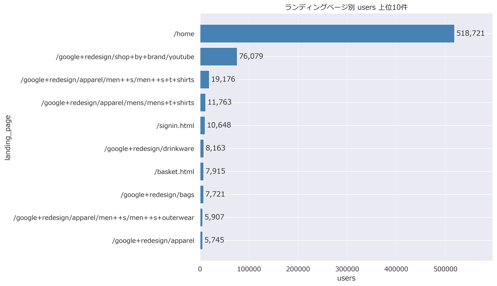
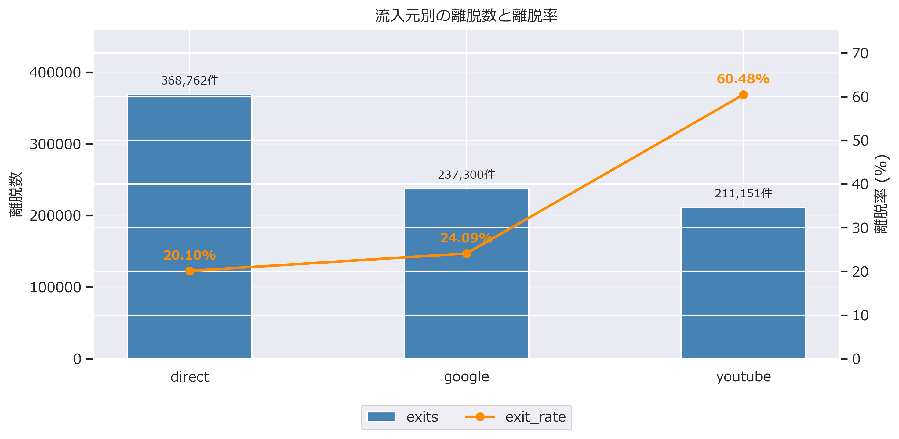

# User Behavior Analysis

## 概要
Google Analytics Sampleデータを用いて、ECサイトにおけるユーザー行動を分析しました。

本分析では、「離脱ページがCV率低下の主要な要因である」という仮説を立て、流入元・デバイス・ブラウザ・ランディングページ・離脱ページを段階的に分析し、最終的にCV率改善のための施策提案まで行っています。

---

## 使用技術

- Python
- Pandas
- NumPy
- Matplotlib
- Seaborn
- SQL（BigQuery）
- Jupyter Notebook

---

## 使用データ

Google BigQuery Public Dataset

**Google Analytics Sample**

データは分析内容ごとにSQLで抽出し、CSVとして保存したものを使用しています。

---

## 分析の流れ

**流入元分析→デバイス分析→ブラウザ分析→ランディングページ分析→離脱ページ分析→施策提案→今後の展望**

ランディングページ分析までの内容は、離脱ページ分析で詳しく分析するための、前提条件として分析結果を出しました。

### ① 流入元分析

#### 仮説

流入元によって購入率に差があり、成果の高い流入チャネルが存在すると考える。

#### 結果

(direct)・google・youtube.comの購入が約90%を占めており、流入元によって購入の傾向が偏っていることが分かりました。

youtube.comはユーザー数が約20万人と多い一方で、購入者数は上位3位にも入らず、流入数に対して購入へつながりにくい傾向が確認できた。


#### 示唆

流入元は商品ページに入るためのものであり、その流入元を何で開いているかが大切になると考えました。

流入元だけでは購入率の違いを十分に説明できないため、次にユーザーが利用しているデバイスとの関係を分析します。


---

### ② デバイス分析

#### 仮説　

デバイスによってユーザー数に違いがあり、ユーザーの周辺環境を推測できると考える。

#### 結果

desktopの使用率が73%であり、購入数の割合では90%であることが分かりました。


#### 示唆

desktopは一度にたくさんの商品を見ることができる一方、mobileやtabletは画面サイズや操作性の制約を受けやすく、使用感の違いでデバイスの使用率に違いが出たと考えられます。

デバイスでは大きく偏りが見られました。次章では、ブラウザによるユーザー数の違いについて分析することでデバイスとの関係を明確にします。

---

### ③ ブラウザ分析

#### 仮説　

ブラウザによる使用率を分析することで、デバイスとのつながりが明らかになる。

#### 結果

Chromeの使用率が70%程であり、Safariが20%程であることが分かりました。

購入者割合で見ると、Chromeが88%と大半を占めています。


#### 示唆

desktopユーザーの中でSafariを使用しているユーザーは25%程なのでSafariユーザーはmobileやtabletを多く使用していると考えられます。

Chromeでgoogleアカウントと同期することで購入までがスムーズになりCV率が上がっている可能性があります。

次章では、離脱ページ分析に大きくかかわると考えているランディングページについて分析し、前提条件を完成させ離脱ページ分析を行います。

---

### ④ ランディングページ分析

#### 仮説

ランディングページの違いによって購入者数に偏りがある。

#### 結果

homeがランディングページであるユーザーが518,721と大半を占めていることが分かりました。

また、youtubeブランドやメンズシャツの特定のカテゴリの商品を目的に覗いているユーザーも多くみられます。



#### 示唆

homeから入るということはブックマークに保存している、もしくは、目的が不確定なままサイトを覗いている可能性が考えられます。

これまで分析してきた前提条件を踏まえてメインテーマである離脱ページ分析を行います。

---

### ⑤ 離脱ページ分析

#### 仮説

離脱ページがCV率低下の主要な要因である

#### 結果

directとgoogleの離脱率は20%前半と、比較的低いが、youtube.comは60%を占めていることが分かります。

よくランディングページとして閲覧されてるページが半分の割合でそのページで離脱していることが分かります。

商品カテゴリはapparelの中でもmen's T-shirtsが多くみられました。



---

### ⑥ 施策提案

分析結果をもとに、

- HomeページのUI改善
- YouTubeブランドページから商品の直接導線追加
- 商品カテゴリ改善

などの施策を提案しました。

---

## 今後の展望

今後は提案した施策についてA/Bテストを実施し、CV率の増加の改善効果を検証する予定です。

継続的な改善サイクルを回すことで、より実践的なデータ分析プロジェクトへ発展させたいと考えています。

---

## フォルダ構成

```
User_Behavior_Analysis
│
├── notebook/
│   └── User_Behavior_Analysis.ipynb
│
├── sql/
│   ├── 01_source.sql
│   ├── 02_device.sql
│   ├── 03_browser.sql
│   ├── 04_landing_page.sql
│   └── 05_exit_page.sql
│
├── images/
│   ├── 01_source.png
│   ├── 02_device.png
│   ├── 03_browser.png
│   ├── 04_landing_page.png
│   └── 05_exit_page.png
│
└── README.md
```

## Author

GitHub Portfolio

データアナリストを目指して学習中。
Python・SQL・Tableauを用いたデータ分析ポートフォリオを公開しています。
