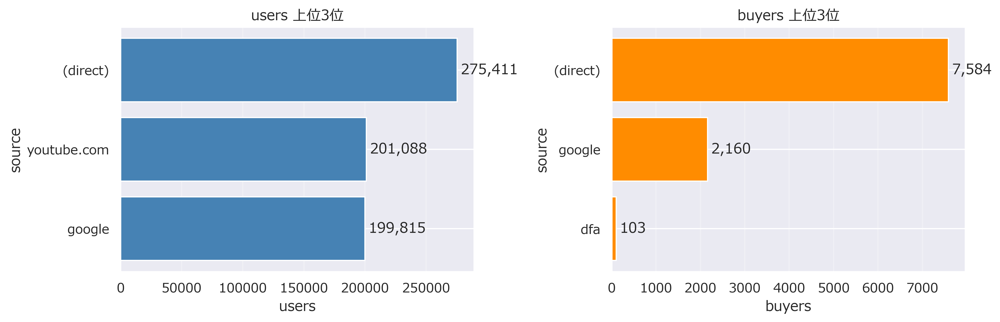
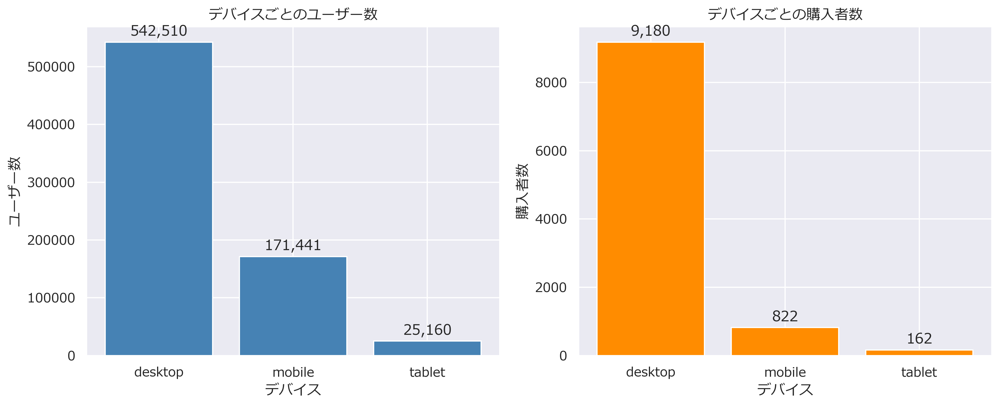
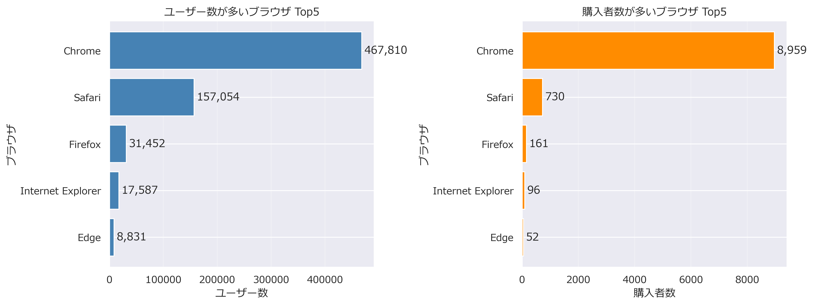

# User Behavior Analysis

## 概要
Google Analytics Sampleデータを用いて、ECサイトにおけるユーザー行動を分析しました。

本分析では、「離脱ページがCV率低下の主要な要因である」という仮説を立て、流入元・デバイス・ブラウザ・ランディングページ・離脱ページを段階的に分析し、最終的にCV率改善のための施策提案まで行っています。

---

## 使用技術

- Python
- Pandas
- NumPy
- Matplotlib
- Seaborn
- SQL（BigQuery）
- Jupyter Notebook

---

## 使用データ

Google BigQuery Public Dataset

**Google Analytics Sample**

データは分析内容ごとにSQLで抽出し、CSVとして保存したものを使用しています。

---

## 分析の流れ

**流入元分析→デバイス分析→ブラウザ分析→ランディングページ分析→離脱ページ分析→施策提案→今後の展望**

ランディングページ分析までの内容は、離脱ページ分析で詳しく分析するための、前提条件として分析結果を出しました。

### ① 流入元分析

#### 仮説

流入元によって購入者に偏りがある。

#### 結果

(direct)・google・youtube.comの購入が約90%を占めており、流入元によって購入の傾向が偏っていることが分かりました。

また、youtube.comが流入元のユーザーは多いが、購入数がとても少ないことも確認できました。



---

### ② デバイス分析

#### 仮説　

デバイスによってユーザー数に違いがある。

#### 結果

desktopの使用率が73%と高いことが分かりました。

desktopは一度にたくさんの商品を見ることができる一方、mobileやtabletは画面サイズや操作性の制約を受けやすく、使用感の違いでデバイスの使用率に違いが出たと考えられます。




---

### ③ ブラウザ分析

#### 仮説　

アクセスしやすいブラウザが存在するのか

#### 結果

Chromeの使用率が70%ほどであり、Safariが20%程であることが分かりました。

購入者割合で見ると、Chromeが88%と大半を占めています。

このことから、Chromeでgoogleアカウントと同期することで購入までがスムーズになりCV率が上がっている可能性があります。



---

### ④ ランディングページ分析

#### 仮説

ランディングページの違いによって購入者数に偏りがある

#### 結果


---

### ⑤ 離脱ページ分析

本分析のメインテーマです。

以下を分析しました。

- 流入元ごとの離脱率
- ランディングページと離脱ページの関係
- 商品カテゴリごとの閲覧状況

---

### ⑥ 施策提案

分析結果をもとに、

- HomeページのUI改善
- YouTubeブランドページから商品の直接導線追加
- 商品カテゴリ改善

などの施策を提案しました。

---

## 主な分析結果

- (direct)からの流入が最も多い
- YouTube経由は利用者が多いにもかかわらずCV率が低い
- Desktop利用者のCV率が高い
- Mobile × SafariはCV率が低い
- Homeページ・YouTubeページでは離脱が多い
- 商品ページへの導線改善が必要であることが分かった

---

## 今後の展望

今後は提案した施策についてA/Bテストを実施し、

- CV率
- 離脱率

の改善効果を検証する予定です。

継続的な改善サイクルを回すことで、より実践的なデータ分析プロジェクトへ発展させたいと考えています。

---

## フォルダ構成

```
User_Behavior_Analysis
│
├── notebook/
│   └── User_Behavior_Analysis.ipynb
│
├── sql/
│   ├── source.sql
│   ├── device.sql
│   ├── browser.sql
│   ├── landing_page.sql
│   └── exit_page.sql
│
├── data/
│   ├── source.csv
│   ├── device.csv
│   ├── browser.csv
│   └── ...
│
├── images/
│   ├── dashboard.png
│   ├── source_analysis.png
│   ├── device_analysis.png
│   ├── landing_page.png
│   └── exit_page.png
│
└── README.md
```

---

## 分析イメージ

### 流入元分析


---

### デバイス分析


---

### ブラウザ分析


---

### ランディングページ分析


---

### 離脱ページ分析


---

## Author

GitHub Portfolio

データアナリストを目指して学習中。
Python・SQL・Tableauを用いたデータ分析ポートフォリオを公開しています。
